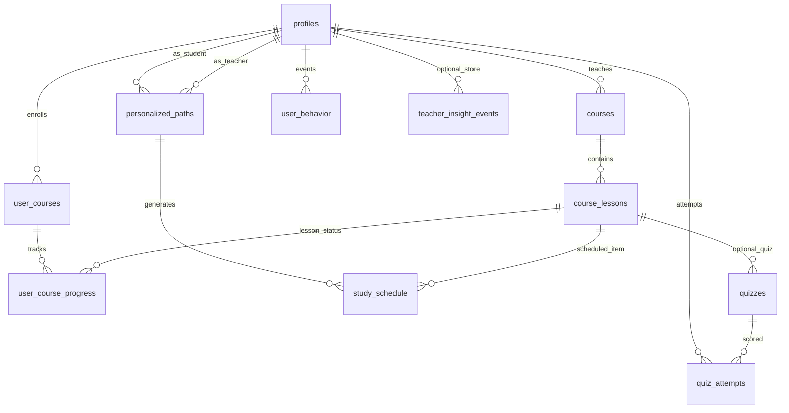

# EduAI — Schema dữ liệu đích (single source of truth)

**Phiên bản:** 1.0 (nháp kiến trúc)  
**Căn cứ:** `PROJECT_AUDIT.md`, migrations hiện có (`courses`, `course_lessons`, `user_courses`, `user_course_progress`, `personalized_paths`, `study_schedule`, `quizzes`, `quiz_attempts`, `user_behavior`, `profiles`).  
**Nguyên tắc:** Một lớp **ý nghĩa nghiệp vụ** rõ cho 5 trụ: **courses**, **personalized paths**, **smart schedule**, **student progress**, **teacher insights**. Vật lý có thể là nhiều bảng nhưng **chỉ một chỗ ghi** cho từng loại dữ liệu (không double-write giữa `courses` và `edu_*` sau khi migration xong).

---

## 1. Bản đồ 5 trụ cột → vật lý

| Trụ SOT (nghiệp vụ) | Bảng / nguồn ghi chính | Ghi chú |
|---------------------|-------------------------|---------|
| **Courses** | `courses`, `course_lessons`, (tùy chọn) `course_chapters`, `course_benefits`, `quizzes` | Nội dung khóa + quiz gắn bài. |
| **Personalized paths** | `personalized_paths` | `course_sequence` JSONB là SOT thứ tự khóa/deadline gợi ý. |
| **Smart schedule** | `study_schedule` | Một dòng = một bài (`lesson_id`) trong một `path_id`, có `due_date`, trạng thái, `miss_count`, ghi chú học sinh. |
| **Student progress** | `user_courses`, `user_course_progress`, `quiz_attempts` | Enrollment + hoàn thành bài + điểm quiz (input cho insight). |
| **Teacher insights** | **Đọc** từ progress + schedule + `user_behavior` (+ assessment nếu cần); **ghi tùy chọn** `teacher_insight_events` (bảng mới, additive) | Không thay thế bảng tiến độ; chỉ lưu snapshot/giải thích AI nếu cần audit. |

**Identity / RBAC:** `profiles` + Supabase Auth — không đổi vai trò trong tài liệu này.

---

## 2. Sơ đồ quan hệ (mục tiêu logic)



*Bảng `teacher_insight_events` là đề xuất mới (mục 5); chưa tồn tại trong DB hiện tại.*

---

## 3. Chuẩn hóa cột quan trọng (không phá dữ liệu)

Các bảng hiện có **giữ nguyên tên**; chỉ **bổ sung** cột/index khi migration tương lai.

### 3.1. `personalized_paths.course_sequence` (JSONB)

Định dạng đích (hợp đồng ứng dụng):

```json
[
  {
    "course_id": "uuid",
    "order_index": 0,
    "due_date": "2026-05-01",
    "note": "optional"
  }
]
```

**CẦN XÁC NHẬN:** Có cần thêm `suggested_by: "ai" | "teacher"` từng phần tử hay chỉ lưu ở metadata path.

### 3.2. `study_schedule`

- **SOT** cho lịch thông minh: mọi UI lịch đọc/ghi qua bảng này (đã có `miss_count`, `student_note`, `is_busy` trong migration 019/029).
- Liên kết: `path_id` → `personalized_paths`, `lesson_id` → `course_lessons`, `user_id` → học sinh.

### 3.3. Student progress

- **Enrollment SOT:** `user_courses` (unique `user_id`, `course_id`).
- **Lesson completion SOT:** `user_course_progress` (unique `user_id`, `course_id`, `lesson_id`), `status` ∈ `pending|completed`.
- **Quiz SOT:** `quiz_attempts` theo `quiz_id` + `user_id`; `quizzes.lesson_id` nối về bài học.

---

## 4. Phân loại bảng (giữ / ngừng mở rộng / migrate)

| Bảng / nhóm | Quyết định đích | Ghi chú |
|-------------|------------------|---------|
| `courses`, `course_lessons` | **Giữ — SOT courses** | Đối chiếu UI hiện tại học sinh/GV. |
| `user_courses`, `user_course_progress` | **Giữ — SOT student progress** | Không song song với `edu_enrollments` sau cutover. |
| `personalized_paths` | **Giữ — SOT paths** | Chỉ mở rộng bằng ADD COLUMN nếu cần. |
| `study_schedule` | **Giữ — SOT schedule** | Edge `handle-missed-deadlines` giữ semantics. |
| `quizzes`, `quiz_attempts` | **Giữ** | Input cho progress & insight. |
| `user_behavior` | **Giữ** | Signal cho insight. |
| `profiles` | **Giữ** | Insight đọc thêm flags streak, assessment, v.v. |
| `edu_*` (toàn bộ) | **Migrate-in → courses domain rồi ngừng mở rộng** | Sync một chiều; **CẦN XÁC NHẬN** cutover. |
| `topics`, `lessons`, `learning_paths` | **Ngừng mở rộng; migrate khi có lực** | Chỉ đọc legacy. |
| `roadmaps`, `custom_roadmaps`, `roadmap_embeddings` | **Ngoài 5 trụ — ngừng mở rộng** trừ khi SP marketing/RAG; **CẦN XÁC NHẬN** | Không ghi vào SOT schedule/path. |
| `connection_requests`, `reports`, `notifications`, … | **Ngoài 5 trụ** | Giữ DB; không nằm trong hợp đồng dashboard đích trừ khi SP yêu cầu. |
| `assessment_responses`, `career_orientations` | **Input phụ cho AI path** | Không thay `personalized_paths` làm SOT path. |

---

## 5. Bảng additive đề xuất (không xóa dữ liệu cũ)

### 5.1. `teacher_insight_events` (nháp tên)

Mục đích: lưu **kết quả phân tích AI** (schedule / hành vi / adherence) phục vụ audit và lịch sử GV — **không** thay cho `study_schedule` hay `user_course_progress`.

| Cột | Kiểu | Mô tả |
|-----|------|--------|
| `id` | uuid PK | |
| `teacher_id` | uuid FK profiles | Người xem/trigger |
| `student_id` | uuid FK profiles | |
| `insight_kind` | text | `schedule_adherence`, `workload`, `risk`, … |
| `payload` | jsonb | Cấu trúc định theo `types/eduai-target-draft.ts` |
| `source` | text | `openai`, `rule`, … |
| `created_at` | timestamptz | |

RLS: teacher chỉ đọc/ghi khi có quan hệ dạy hợp lệ (**CẦN XÁC NHẬN** chi tiết policy).

**Lưu ý:** Migration chỉ `CREATE TABLE IF NOT EXISTS` + policy; không `DROP` bảng khác.

---

## 6. Teacher insights như read model

SOT **không** là một bảng duy nhất mà là **định nghĩa tập hợp**:

- **Schedule health:** từ `study_schedule`.
- **Progress:** từ `user_course_progress` + `user_courses`.
- **Hành vi:** từ `user_behavior` (rollup theo `event_type`).
- **Quiz:** từ `quiz_attempts` join `quizzes`.
- **AI narrative:** response của endpoint insight; tùy chọn persist vào `teacher_insight_events`.

---

## 7. Tham chiếu type nháp

Xem `types/eduai-target-draft.ts` và `API_CONTRACTS.md`.

---

*Tài liệu thiết kế; không ra lệnh migration phá dữ liệu.*
